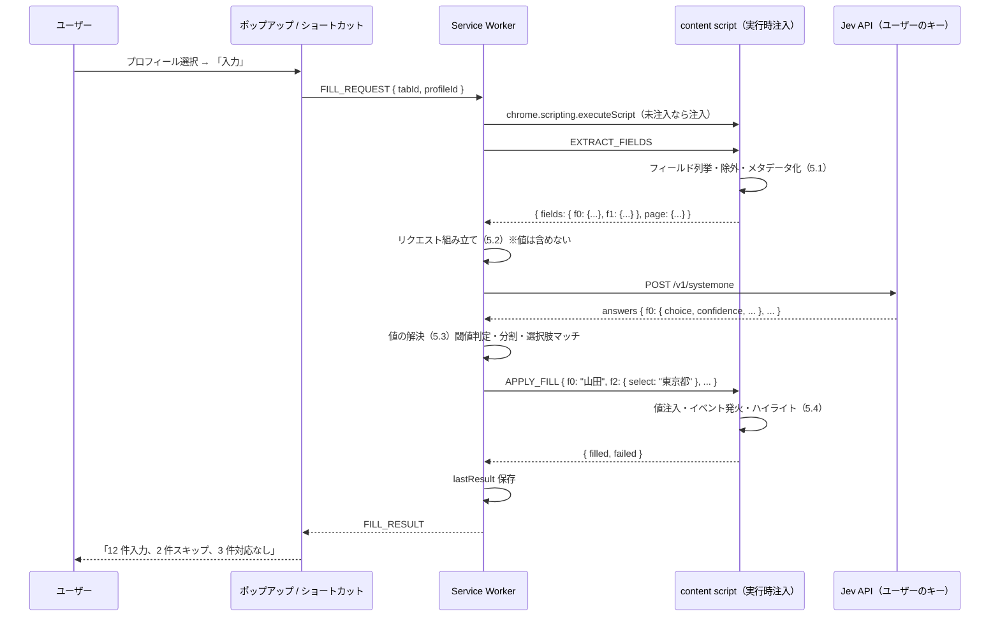

# 01. 機能要件定義

作成日: 2026-09-21
前提: [00-concept.md](00-concept.md) の基本原則 P1〜P5 に従う。

## 1. 機能一覧（MoSCoW）

### Must（MVP 必須）

| ID | 機能 | 概要 |
|---|---|---|
| F-01 | プロフィール管理 | 複数プロフィールの作成・編集・削除・複製。名前とアイコン色で識別 |
| F-02 | プロフィール項目 | 2.3 のスキーマに従う項目の入力。派生項目（氏名一体型、分割など）はコードが生成 |
| F-03 | フォーム検出・フィールド抽出 | アクティブタブの入力フィールドを列挙し、メタデータを取得。除外ルール適用 |
| F-04 | Jev による項目判定 | 抽出したフィールド全件を 1 リクエストで Jev に送り、フィールド → 項目の対応を得る |
| F-05 | 値の解決 | 対応付け結果とプロフィールから、各フィールドに入れる文字列／選択肢を決定（分割・正規化含む） |
| F-06 | 入力実行 | content script が値を注入。React 等の制御コンポーネントでも反映されるようにイベントを発火 |
| F-07 | 結果表示 | 入力したフィールドのハイライト、ポップアップに件数サマリ（入力／スキップ／対応なし） |
| F-08 | ポップアップからの実行 | プロフィール選択 → 「このページに入力」 |
| F-09 | キーボードショートカット | 既定 `Alt+Shift+F`。前回使ったプロフィールで即実行 |
| F-10 | Jev プロバイダ設定 | OpenRouter / TypeSafe 直接の切替、API キー入力、接続テスト |
| F-11 | インポート／エクスポート | 全プロフィールを JSON ファイルで書き出し・読み込み |
| F-12 | i18n | 日本語・英語（`chrome.i18n`、既定 ja） |
| F-13 | オンボーディング | 初回インストール時にオプションページを開き、キー設定とプロフィール作成を案内 |

### Should（MVP 直後）

| ID | 機能 | 概要 |
|---|---|---|
| F-20 | 入力の取り消し（Undo） | 直前の入力を元の値に戻す。即入力方式の安全弁 |
| F-21 | サイトごとの対応付け記憶 | 同一オリジン・同一フォーム構造なら Jev を呼ばず前回の対応付けを再利用 |
| F-22 | 入力前プレビュー（任意設定） | 設定でオンにすると「項目 → 値」一覧を確認してから入力 |
| F-23 | 郵便番号 → 住所補完 | プロフィール編集時に郵便番号から都道府県・市区町村を補完（外部 API。プロフィール編集時のみ、ユーザー操作起点） |

### Could

| ID | 機能 | 概要 |
|---|---|---|
| F-30 | フリガナ自動生成 | 漢字氏名からカナを推定（辞書ベース、ローカル） |
| F-31 | 右クリックメニューからの実行 | コンテキストメニューに「このフォームに入力」 |
| F-32 | 対応付けの手動修正 | 結果画面でフィールドの項目を変え、サイト記憶（F-21）に反映 |
| F-33 | Cloudflare Workers AI プロバイダ | 第 3 のプロバイダ |
| F-34 | 追加項目 | 役職、Web サイト URL、会社住所、FAX など |

### Won't（MVP では実装しない）

- カード情報・パスワードの保存と入力
- フォームの自動送信、submit ボタンのクリック
- content script の常駐（ページ内バナー提案）
- クラウド同期、アカウント
- Jev に値を送る処理（選択肢マッチングのフォールバック等）
- 課金

## 2. データモデル

### 2.1 保存領域

すべて `chrome.storage.local`。`chrome.storage.sync` は使用禁止（P1）。

```
storage.local
├── profiles: Profile[]
├── settings: Settings
├── lastResult: FillResult | null      // ポップアップ表示用、直近 1 件
└── siteMemory: SiteMemory             // F-21（Should）
```

### 2.2 Profile

```ts
interface Profile {
  id: string;            // UUID
  name: string;          // 表示名（例: 個人、会社）
  color: string;         // アイコン色（識別用）
  fields: ProfileFields; // 2.3
  createdAt: string;     // ISO 8601
  updatedAt: string;
}
```

### 2.3 ProfileFields（ユーザーが入力する項目）

| キー | 型 | 例 | 備考 |
|---|---|---|---|
| `family_name` | string | 山田 | |
| `given_name` | string | 太郎 | |
| `family_name_kana` | string | ヤマダ | カタカナで保存。ひらがな要求時はコードで変換 |
| `given_name_kana` | string | タロウ | 同上 |
| `family_name_romaji` | string | YAMADA | |
| `given_name_romaji` | string | TARO | |
| `email` | string | | |
| `phone` | string | 090-1234-5678 | ハイフン区切りで保存。分割時の区切りに使う |
| `postal_code` | string | 100-0001 | ハイフン区切りで保存 |
| `prefecture` | string | 東京都 | |
| `city` | string | 千代田区 | |
| `address_line1` | string | 千代田1-1-1 | 町名・番地 |
| `address_line2` | string | サンプルマンション101 | 建物名・部屋番号 |
| `city_kana` | string | チヨダク | 市区町村のカナ。金融・決済系フォーム（Stripe Connect 等）の住所カナ欄向け（2026-09-22 追加） |
| `address_line1_kana` | string | チヨダ1-1-1 | 町名・番地のカナ |
| `address_line2_kana` | string | サンプルマンション101 | 建物名・部屋番号のカナ |
| `website` | string | https://example.com | ホームページ・会社サイトの URL（2026-09-22 追加） |
| `bank_name` | string | 三菱UFJ銀行 | 銀行口座（振込先・売上入金口座フォーム向け。2026-09-22 追加。カード情報は引き続きスコープ外） |
| `bank_code` | string | 0005 | 金融機関コード 4 桁 |
| `branch_name` | string | 渋谷支店 | 支店名 |
| `branch_code` | string | 135 | 支店コード・店番 3 桁 |
| `account_type` | `'ordinary' \| 'current' \| 'savings' \| ''` | ordinary | 預金種別。テキスト欄には「普通 / 当座 / 貯蓄」、select/radio は同義語（普通預金・Savings・ふつう 等）で照合 |
| `account_number` | string | 1234567 | 口座番号（通常 7 桁） |
| `sns_x` / `sns_youtube` / `sns_instagram` / `sns_facebook` / `sns_tiktok` / `sns_github` / `sns_linkedin` / `sns_note` | string | @yamada / https://github.com/yamada | SNS のアカウント ID または URL（2026-09-22 追加）。URL 欄（`type=url`、ラベル/placeholder/name に URL・http・リンク）には各サービスのプロフィール URL に変換して入力、それ以外は保存値のまま |

#### 2.3.1 ユーザー定義項目（`Profile.customFields`、2026-09-22 追加）

固定スキーマにない項目（SNS の ID、社員番号、資格番号など）をユーザーが追加できる。

| フィールド | 型 | 説明 |
|---|---|---|
| `id` | `` `custom_${string}` `` | `custom_` + ランダム 8 文字。Jev の choice キーとしてそのまま使う |
| `label` | string | 表示名。Jev への説明にも使う。空なら Jev に提示しない |
| `description` | string | 任意の補足。Jev への説明にのみ使う（英語推奨） |
| `value` | string | 入力する値。**Jev には送らない** |

- Jev への `state.profile` は「固定項目 + ユーザー定義項目（`User-defined entry "<label>": <description>`）+ none」の順で組み立てる（`buildProfileDescriptions`）
- 回答検証の criteria キー一覧もプロフィールごとに動的に組む
- ポップアップの詳細表示では `custom_xxxx` ではなく `label` を出す（`FieldOutcome.choiceLabel`）
- 旧データ（`customFields` なし）は読み込み時に `[]` で補う
| `country` | string | 日本 | |
| `company` | string | | |
| `department` | string | | |
| `birth_date` | string | 1990-01-31 | ISO 形式 |
| `gender` | enum | male / female / other / no_answer | |

### 2.4 派生項目（コードが生成。ユーザーは入力しない）

| キー | 生成元 | 生成ルール |
|---|---|---|
| `full_name` | family_name + given_name | 半角スペース区切り（フォームの placeholder に全角スペースがあれば全角） |
| `full_name_kana` | family_name_kana + given_name_kana | 同上 |
| `full_name_romaji` | given_name_romaji + family_name_romaji | 英語順 |
| `address_full` | prefecture + city + address_line1 + address_line2 | 区切りなし連結 |
| `prefecture_kana` | prefecture → 47 都道府県の固定表 | 「東京」「東京都」どちらの表記でも解決。表にない値は未設定扱い |
| `address_kana_full` | prefecture_kana + city_kana + address_line1_kana + address_line2_kana | 区切りなし連結。ラベルが「ふりがな／ひらがな」ならひらがな変換（氏名カナと同じ規則） |
| `account_holder_kana` | = full_name_kana | 口座名義（カナ）。銀行フォームは通常カナ名義を要求する |
| `account_holder` | = full_name | 口座名義（漢字） |
| `birth_year` / `birth_month` / `birth_day` | birth_date | 数値。select の選択肢に合わせて「1990」「1990年」「01」「1」を吸収 |
| `age` | birth_date | 実行時点の満年齢 |
| `phone` の分割 | phone | ハイフンで分割。3 分割フォームなら 3 パーツ、2 分割なら先頭と残り |
| `postal_code` の分割 | postal_code | ハイフンで 2 分割（3 桁 + 4 桁） |
| かな変換 | *_kana | ラベルに「ふりがな」「ひらがな」があればひらがなへ変換。「フリガナ」「カタカナ」「カナ」はそのまま |

Jev に提示する項目名は 2.3 + 2.4 の和集合 + `none`（PoC の `profile-fields.ts` に準拠）。

### 2.5 Settings

```ts
interface Settings {
  provider: 'openrouter' | 'typesafe';
  apiKey: string;                 // ユーザー自身のキー。local のみ
  model?: string;                 // 既定: openrouter → 'typesafe/jev-1.13', typesafe → 'jev-latest'
  lastProfileId: string | null;   // ショートカット実行に使う
  confidenceThreshold: number;    // 既定 0.7
  highlightFilled: boolean;       // 既定 true
  previewBeforeFill: boolean;     // 既定 false（F-22）
  locale?: 'ja' | 'en';           // 未設定ならブラウザに従う
}
```

### 2.6 FillResult

```ts
interface FillResult {
  url: string;               // オリジン + パス（クエリは保存しない）
  profileId: string;
  at: string;
  filled: number;
  skippedLowConfidence: number;
  noMatch: number;
  excluded: number;          // password / cc-* 等で除外した数
  latencyMs: number;
  inputTokens: number;
  error?: string;
}
```

## 3. 画面一覧

| 画面 | 種別 | 主な要素 |
|---|---|---|
| ポップアップ | `action.default_popup` | プロフィール選択、「このページに入力」ボタン、直近結果サマリ、設定リンク。キー未設定／プロフィール未作成時は案内 |
| オプション: プロフィール | `options_page`（タブ） | プロフィール一覧、追加・複製・削除、編集フォーム、インポート／エクスポート |
| オプション: API 設定 | 同上 | プロバイダ選択、キー入力（マスク表示）、接続テスト、キー取得手順のリンク |
| オプション: 動作設定 | 同上 | 確信度閾値、ハイライト、プレビュー、ショートカット変更への導線（`chrome://extensions/shortcuts`） |
| オプション: プライバシー | 同上 | 何を送り何を送らないかの説明、プライバシーポリシーへのリンク |
| ページ内オーバーレイ | content script | 入力済みフィールドのハイライト（枠線）、完了トースト（件数） |

ワイヤーフレームは [03-uiux-definition.md](03-uiux-definition.md)。

## 4. 主要フロー

### 4.1 自動入力（メインフロー）



### 4.2 初回セットアップ

1. インストール → `chrome.runtime.onInstalled` でオプションページを開く
2. 「API 設定」タブ: プロバイダ選択 → キー取得手順（OpenRouter: openrouter.ai/keys、TypeSafe: console.typesafe.ai）→ キー入力 → 接続テスト（最小の Noul 1 問）
3. 「プロフィール」タブ: 最初のプロフィールを作成
4. ポップアップが使用可能状態になる

### 4.3 ショートカット実行

1. `Alt+Shift+F` → `chrome.commands.onCommand`
2. `settings.lastProfileId` があれば 4.1 を実行。なければポップアップを開くよう促す通知（`chrome.action.openPopup` は制約があるため、バッジ表示で誘導）

### 4.4 インポート／エクスポート

- エクスポート: 全プロフィールを `{ version, exportedAt, profiles }` の JSON でダウンロード。API キー・設定は含めない
- インポート: ファイル選択 → スキーマ検証 → 「追加」または「置換」を選択 → 保存。同じ id は上書き確認

## 5. 処理仕様

### 5.1 フィールド抽出（content script）

**対象**: `input`, `select`, `textarea`, `[contenteditable=true]`（textarea 相当として扱う）

**除外**（Jev に送らず、入力もしない）:

| 条件 | 理由 |
|---|---|
| `input[type=password]` | P3 |
| `input[type=file]`, `hidden`, `submit`, `button`, `image`, `reset` | 入力対象でない |
| `autocomplete` が `cc-` で始まる | カード情報（P3） |
| ラベル／name が `カード番号|card.?number|cvv|cvc|セキュリティコード|有効期限|暗証番号|暗証|\bpin\b|passcode` に一致 | `autocomplete` のないカード欄、暗証番号（PIN）欄（2026-09-22 追加）。銀行口座（口座番号・支店コード）は除外しない |
| `readonly`, `disabled` | 入力不可 |
| 非表示（`checkVisibility()` false、サイズ 0、`aria-hidden` 祖先） | ユーザーに見えない |
| `input[type=search]` でフォーム外 | サイト内検索 |

**メタデータ**（フィールドごと）:

```ts
interface ExtractedField {
  tag: 'input' | 'select' | 'textarea';
  type?: string;            // input の type
  name?: string;
  id?: string;              // DOM の id（属性）。Jev への参照キーとは別
  autocomplete?: string;
  label: string;            // 5.1.1 の優先順位で解決
  placeholder?: string;
  required?: boolean;
  maxlength?: number;
  section?: string;         // 直近の見出し（h1–h6、legend、th）
  options?: string[];       // select / radio。先頭 8 件 + 件数
  currentValue?: 'empty' | 'filled';  // 既入力かどうか。値そのものは送らない
}
```

**5.1.1 ラベル解決の優先順位**: `aria-labelledby` → `aria-label` → `<label for>` → 祖先 `<label>` → 同じ `<tr>` の `<th>` / 直前の `<dt>` → 直前の兄弟テキスト → `placeholder` → `title` → `name`

**5.1.2 参照キー**: 抽出順に `f0, f1, ...` を振り、`fields` は**配列ではなく `{ f0: {...} }` のオブジェクト**にする（PoC で配列インデックス参照が 10 番目以降でずれる現象を確認済み）。content script 側で DOM 要素との対応表を保持する。

**5.1.3 radio グループ**: 同じ `name` の radio は 1 フィールドにまとめ、`options` に各ラベルを入れる。

**5.1.4 上限**: 60 フィールドを超える場合は先頭 60 件（Jev のトークン上限 32k に対して余裕を持たせる）。超過分はスキップとして件数報告。

### 5.2 Jev リクエスト（Service Worker）

PoC の `keyed` バリアントに準拠。

```jsonc
{
  "model": "typesafe/jev-1.13",
  "state": {
    "page": { "url": "<origin+path>", "title": "...", "lang": "ja" },
    "fields": { "f0": { "tag": "input", "type": "text", "name": "sei", "label": "姓", ... }, "f1": {...} },
    "profile": { "family_name": "Family name / surname in kanji（姓・苗字）", ..., "none": "No profile value fits ..." }
  },
  "questions": {
    "f0": { "type": "choice",
            "instructions": "Which profile entry should be typed or selected into `fields.f0`? Pick `none` if ... Entry meanings are in `profile`.",
            "criteria": { "family_name": null, "given_name": null, ..., "none": null } },
    "f1": { ... }
  }
}
```

- `state.profile` は項目名と説明のみ。**値は含めない**（P1）
- `page.url` はクエリ文字列・フラグメントを除く
- ガードレール Noul（`is_payment` 等）は、カード欄を観測段階で除外する方針にしたため MVP では送らない
- タイムアウト 10 秒、429/529 は `Retry-After` を尊重して最大 2 回リトライ
- レスポンスは `choice` が criteria に含まれるか、`probabilities` の合計が 1±0.02 か、`choice` が最大確率か、を検証。不正なら 1 回だけ再送、再度不正ならエラー

### 5.3 値の解決（Service Worker）

各フィールド `f` の回答 `{ choice, confidence }` に対して:

1. `choice === 'none'` → **対応なし**
2. `confidence < settings.confidenceThreshold`（既定 0.7）→ **スキップ（低確信度）**
3. `choice` に対応するプロフィール値（2.3／2.4）が空 → **スキップ（未設定）**
4. 分割グループの解決: 同じ `choice`（`phone` / `postal_code`）が DOM 順で連続する複数フィールドに付いた場合、ハイフン分割したパーツを順に割り当てる。パーツ数が合わなければ先頭フィールドに全体を入れ、残りはスキップ
5. `select` / radio: 5.3.1 の正規化マッチ。一致しなければ**スキップ（選択肢不一致）**
6. `input[type=date]`: `YYYY-MM-DD`。`type=month` は `YYYY-MM`
7. かな: ラベルに「ふりがな」「ひらがな」を含めばひらがな変換
8. `maxlength` を超える値は入れない（スキップ）
9. `currentValue === 'filled'` のフィールドは**上書きしない**（既定。設定で変更可）

**5.3.1 選択肢の正規化マッチ**

| 対象 | 正規化 |
|---|---|
| 共通 | trim、全角→半角（英数）、半角→全角（カナ）、空白除去、大文字小文字無視 |
| 都道府県 | 「東京」⇄「東京都」、「大阪」⇄「大阪府」など接尾辞の有無を吸収 |
| 年・月・日 | 「1990年」「1990」「90」、「01」「1」「1月」を吸収。年は西暦のみ（和暦 select は対応なし＝スキップ） |
| 性別 | male: 男性／男／Male／M、female: 女性／女／Female／F、other: その他、no_answer: 回答しない／無回答 |
| 国 | 日本／Japan／JP／JPN |

一致は完全一致 → 正規化一致 → 前方一致（一意な場合のみ）の順。Jev へのフォールバックは行わない（P1）。

### 5.4 入力実行（content script）

- テキスト系: `HTMLInputElement.prototype` / `HTMLTextAreaElement.prototype` の `value` setter を直接呼び、`input`（`InputEvent`, `inputType: 'insertText'`）→ `change` を `bubbles: true` で発火。`focus` → 設定 → `blur` の順
- `select`: `value` 設定 → `input` → `change`
- radio: 対象 option の `click()`
- checkbox: 対象外（MVP では扱わない。同意チェック等は人間が行う）
- `contenteditable`: `textContent` 設定 → `input`
- 各フィールド設定後、`requestAnimationFrame` を挟んで次へ（連動して選択肢が変わるフォームへの配慮。都道府県 → 市区町村の動的更新は MVP では追わない）
- ハイライト: 入力したフィールドに `outline` を付与し、5 秒後に消す。DOM に属性を書き込まない（`WeakMap` で管理）
- **submit は絶対に呼ばない。Enter も送らない**

### 5.5 エラーと例外

| 状況 | 挙動 |
|---|---|
| API キー未設定 | ポップアップで案内。実行しない |
| 401 | 「キーが無効です」＋ API 設定への導線 |
| 429 / 529 | リトライ後も失敗なら「混雑しています。少し待って再試行してください」 |
| ネットワーク不通・タイムアウト | 「Jev に接続できません」。TypeSafe の status ページへのリンク |
| フィールド 0 件 | 「入力できるフォームが見つかりません」 |
| `chrome://` 等の注入不可ページ | 「このページでは使えません」 |
| 回答の検証失敗 | 1 回再送。再失敗で「判定結果が不正です」 |
| フィールド 0 件だが可視な別オリジン iframe がある | 「フォームは別サイトの枠（iframe）内にあります」＋「許可して再実行」ボタン。押すと `permissions.request` でその iframe のオリジンを許可し再実行（2026-09-22、Stripe Connect のホスト型オンボーディングで判明） |
| iframe 内フォーム | `allFrames: true` で全フレームに注入し、フレームごとの抽出結果を通し ID で統合して 1 リクエストにまとめる。入力はフレーム別に分配、トーストは最上位フレームのみ。未許可のクロスオリジン iframe は上記の権限案内へ |

## 6. 権限とマニフェスト

```jsonc
{
  "manifest_version": 3,
  "default_locale": "ja",
  "permissions": ["activeTab", "scripting", "storage"],
  "host_permissions": ["https://api.typesafe.ai/*", "https://openrouter.ai/*"],
  // 既定は無効。クロスオリジン iframe 内のフォーム向けに、ユーザーが許可したオリジンのみ実行時に有効化
  "optional_host_permissions": ["https://*/*", "http://*/*"],
  "action": { "default_popup": "popup.html" },
  "options_page": "options.html",
  "background": { "service_worker": "background.js", "type": "module" },
  "commands": {
    "fill-form": { "suggested_key": { "default": "Alt+Shift+F" }, "description": "__MSG_cmd_fill__" }
  }
}
```

- `content_scripts` は宣言しない（実行時注入）
- `tabs` 権限は不要（`activeTab` で URL・タイトルを取得できる）
- `<all_urls>` は固定権限としては使わない。`optional_host_permissions` は「許可して再実行」をユーザーが押したオリジン 1 件ずつにしか実際の権限を付与しない

## 7. i18n

- `_locales/ja/messages.json`（既定）、`_locales/en/messages.json`
- UI 文言、コマンド説明、ストア掲載文をメッセージ化
- Jev への `instructions` と `profile` の説明は**常に英語**（判定精度のため）。UI 言語に依存しない
