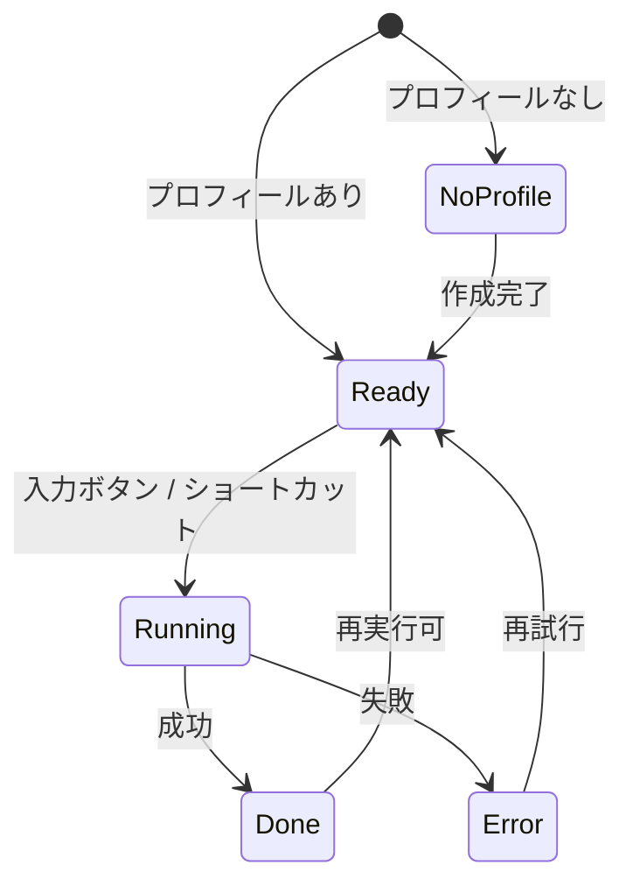

# 03. UI/UX 定義

作成日: 2026-09-21
方針: 日本語・英語対応、ミニマル。ポップアップは「選んで押す」だけ、設定はオプションページに集約。

## 1. デザイン方針

- **ポップアップは 1 アクション**: プロフィールを選んで「入力」を押す。それ以外は極力置かない
- **状態が一目で分かる**: キー未設定／プロフィール未作成／実行中／完了／エラーを、色と 1 行の文で示す
- **入力結果はページ上で確認できる**: 埋めたフィールドに枠線を付け、何が起きたかを隠さない
- **説明は短く、根拠はリンク先に**: プライバシーやキー取得手順は設定画面のタブに置き、ポップアップには出さない
- **装飾は最小限**: システムフォント、単色アクセント、影は 1 段階まで。ダークモード対応（`prefers-color-scheme`）

## 2. ナビゲーション構造

```
ツールバーアイコン
└── ポップアップ
    ├── プロフィール選択（ドロップダウン）
    ├── [このページに入力]
    ├── 直近の結果（1 行）
    └── ⚙ 設定 → オプションページ

オプションページ（タブ）
├── プロフィール
│   ├── 一覧（追加 / 複製 / 削除）
│   ├── 編集フォーム
│   └── インポート / エクスポート
├── 動作設定
│   ├── 確信度の閾値
│   ├── ハイライト / 既存値の上書き / プレビュー
│   └── ショートカット（chrome://extensions/shortcuts への導線）
└── プライバシー
    ├── 何を送り、何を送らないか
    └── プライバシーポリシー / ソースコードへのリンク

ページ内（content script、実行時のみ）
├── 入力済みフィールドの枠線ハイライト
└── 完了トースト（右下、5 秒）
```

キーボードショートカット `Alt+Shift+F` はポップアップを経由せず、前回のプロフィールで実行する。

## 3. 主要画面ワイヤーフレーム

### 3.1 ポップアップ（通常状態）

幅 320px、高さは内容に応じて（最大 400px）。

```
┌──────────────────────────────────┐
│ ◉ Auto Form Filler          ⚙   │
├──────────────────────────────────┤
│ プロフィール                       │
│ ┌──────────────────────────────┐ │
│ │ ● 個人（山田 太郎）        ▾ │ │
│ └──────────────────────────────┘ │
│                                  │
│ ┌──────────────────────────────┐ │
│ │      このページに入力          │ │
│ └──────────────────────────────┘ │
│  Alt+Shift+F でも実行できます      │
│                                  │
│ 前回: 12 件入力・2 件スキップ      │
│       shop.example.jp  3 分前     │
└──────────────────────────────────┘
```

### 3.2 ポップアップ（実行中 → 完了）

```
実行中                              完了
┌──────────────────────────┐      ┌──────────────────────────┐
│ ● 個人               ▾   │      │ ● 個人               ▾   │
│ ┌──────────────────────┐ │      │ ┌──────────────────────┐ │
│ │ ◌ 判定中…            │ │  →   │ │   このページに入力     │ │
│ └──────────────────────┘ │      │ └──────────────────────┘ │
│                          │      │ ✓ 12 件入力しました        │
│                          │      │   スキップ 2（確信度不足）  │
│                          │      │   対応なし 3・除外 1       │
│                          │      │   [詳細]                  │
└──────────────────────────┘      └──────────────────────────┘
```

「詳細」を開くと、フィールドごとの結果（ラベル → 項目名 / 確信度 / 状態）を一覧表示。値は表示しない（肩越しの覗き見対策。項目名で十分）。

### 3.3 ポップアップ（未設定状態）

```
プロフィール未作成
┌──────────────────────────┐
│ ◉ Auto Form Filler   ⚙   │
├──────────────────────────┤
│ プロフィールがありません     │
│                          │
│ 氏名や住所を登録すると       │
│ 入力できるようになります。    │
│                          │
│ [プロフィールを作成する]     │
└──────────────────────────┘
```

API キーの設定が不要になったため、未設定状態はこの 1 つだけになった（2026-09-23）。

### 3.4 ポップアップ（エラー）

```
┌──────────────────────────┐
│ ● 個人               ▾   │
│ ┌──────────────────────┐ │
│ │   もう一度入力         │ │
│ └──────────────────────┘ │
│ ✕ Jev に接続できません      │
│   TypeSafe の障害の可能性が  │
│   あります。[稼働状況を見る] │
└──────────────────────────┘
```

エラー種別ごとの文言は機能要件 5.5 に対応。

### 3.5 オプション: プロフィール

```
┌────────────────────────────────────────────────────────────────┐
│ Auto Form Filler                                               │
│ [プロフィール] [動作設定] [プライバシー]                          │
├────────────────┬───────────────────────────────────────────────┤
│ ● 個人          │ プロフィール名  [個人            ]  色 ●●●●●   │
│ ● 会社          │                                               │
│ + 追加          │ ── 氏名 ──────────────────────────────────    │
│                │ 姓 [山田    ] 名 [太郎    ]                     │
│ [インポート]     │ セイ [ヤマダ  ] メイ [タロウ  ]                  │
│ [エクスポート]   │ 姓（ローマ字）[YAMADA ] 名（ローマ字）[TARO  ]     │
│                │                                               │
│                │ ── 連絡先 ────────────────────────────────    │
│                │ メール [                    ]                  │
│                │ 電話   [090-1234-5678      ]  ハイフン区切り     │
│                │                                               │
│                │ ── 住所 ──────────────────────────────────    │
│                │ 郵便番号 [100-0001]  都道府県 [東京都      ▾]    │
│                │ 市区町村 [千代田区          ]                   │
│                │ 番地     [千代田1-1-1       ]                   │
│                │ 建物名   [サンプルマンション101]                  │
│                │ 国       [日本              ]                   │
│                │                                               │
│                │ ── 所属 ──────────────────────────────────    │
│                │ 会社名 [            ] 部署名 [            ]     │
│                │                                               │
│                │ ── その他 ────────────────────────────────    │
│                │ 生年月日 [1990-01-31]  性別 (○男性 ○女性 ○その他 ○回答しない) │
│                │                                               │
│                │                    [複製] [削除]     [保存]     │
└────────────────┴───────────────────────────────────────────────┘
```

- 保存は明示的なボタン（自動保存はしない。誤編集の防止）
- 電話・郵便番号はハイフン区切りで入力してもらい、分割入力への分配はハイフン位置で行う。ハイフンなし入力は保存時に正規化を提案
- 未入力の項目は入力対象にならない旨をフォーム上部に 1 行で説明

### 3.6 オプション: API 設定（廃止）

2026-09-23 にプロキシ Worker 方式へ移行したため、このタブは削除した。
利用者が設定する項目はなく、インストール直後から判定が動く。

### 3.7 オプション: 動作設定

```
│ 確信度の閾値   [====●=====] 0.70                                 │
│                低いと多く埋まるが誤りも増える / 高いと確実だが少ない │
│ [✓] 入力したフィールドをハイライトする                              │
│ [ ] 既に値があるフィールドも上書きする                              │
│ [ ] 入力前にプレビューを表示する（Should）                          │
│ [ ] 送信内容をコンソールに出力する（開発者向け）                      │
│                                                                │
│ ショートカット  Alt+Shift+F  [変更する →]  (chrome://extensions/shortcuts) │
```

### 3.8 オプション: プライバシー

```
│ この拡張が送信するもの（Jev API へ）                               │
│  ・フォームの各項目のラベル・name・種類・プレースホルダー            │
│  ・ページの URL（クエリを除く）とタイトル                           │
│  ・プロフィールの「項目名」（例: 姓、メールアドレス）                 │
│                                                                │
│ 送信しないもの                                                   │
│  ・プロフィールに登録した値（氏名・住所・電話番号など）              │
│  ・ページに入力済みの値                                           │
│  ・パスワード、カード情報（読み取りもしません）                      │
│                                                                │
│ 保存場所: この端末の Chrome 内のみ。同期・クラウド保存はしません。     │
│ [プライバシーポリシー]  [ソースコード（GitHub）]                    │
```

### 3.9 ページ内ハイライトとトースト

```
   姓  ┌──────────┐   名  ┌──────────┐
       │ 山田      │       │ 太郎      │      ← 2px のアクセント色枠線
       └──────────┘       └──────────┘         5 秒でフェードアウト

                                    ┌────────────────────────┐
                                    │ ✓ 12 件入力しました       │  ← 右下トースト
                                    │   スキップ 2・対応なし 3   │     5 秒で消える
                                    └────────────────────────┘
```

- ハイライトはページの CSS に干渉しないよう `outline` と `outline-offset` のみ使用。DOM 属性を書き込まない
- トーストは Shadow DOM 内に描画し、ページのスタイルの影響を受けない
- スキップしたフィールドには点線枠（任意設定、既定オフ）

## 4. 状態遷移（ポップアップ）



## 5. ビジュアル

### 5.1 カラー

| 用途 | ライト | ダーク |
|---|---|---|
| 背景 | `#FFFFFF` | `#1F1F1F` |
| サーフェス（カード） | `#F6F7F9` | `#2A2A2A` |
| テキスト | `#1A1A1A` | `#EDEDED` |
| 補助テキスト | `#6B7280` | `#9CA3AF` |
| アクセント（ボタン・ハイライト枠） | `#2563EB` | `#60A5FA` |
| 成功 | `#16A34A` | `#4ADE80` |
| 警告 | `#D97706` | `#FBBF24` |
| エラー | `#DC2626` | `#F87171` |
| 境界線 | `#E5E7EB` | `#3F3F46` |

プロフィールの識別色は 8 色のプリセット（アクセント系を避け、判別しやすい彩度）。

### 5.2 タイポグラフィ

- フォント: `system-ui, -apple-system, "Segoe UI", "Hiragino Sans", "Noto Sans JP", sans-serif`
- サイズ: 本文 13px（ポップアップ）／14px（オプション）、見出し 15px semibold、補助 12px
- 行間 1.5

### 5.3 コンポーネント

- ボタン: 主ボタンはアクセント塗り、副ボタンは枠線。高さ 36px、角丸 6px
- 入力欄: 高さ 32px、角丸 4px、フォーカス時にアクセント色の 2px リング
- ドロップダウン（プロフィール選択）: 色ドット + 名前 + 副情報（氏名）
- トグル／チェックボックス: ネイティブをベースにスタイル調整
- スライダー（閾値）: ネイティブ `range` + 現在値表示

## 6. i18n 上の配慮

- 文言は `_locales/{ja,en}/messages.json`。プレースホルダーで件数を埋める（語順の違いに対応）
- 英語 UI でもプロフィール項目のラベルは日本のフォーム前提（"Family name (kanji)", "Family name (kana)" のように補足）
- 日付は `input[type=date]` を使い、ロケール表示はブラウザに任せる
- 幅は英語の長い文言でも崩れないよう、ポップアップの主ボタンは折り返し可

## 7. アクセシビリティ

- すべての操作をキーボードで完結（Tab 順序、Enter で実行、Esc で閉じる）
- 主要要素に `aria-label`、状態変化は `aria-live="polite"` で通知
- コントラスト比 AA 以上（5.1 のパレットで検証済みの組み合わせのみ使用）
- ハイライトは枠線 + トーストの文で伝え、色のみに依存しない
